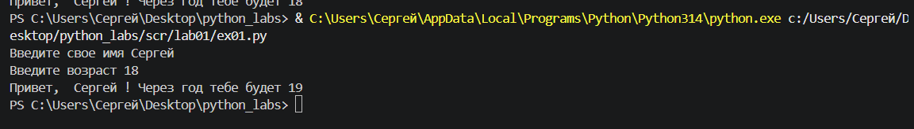
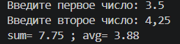
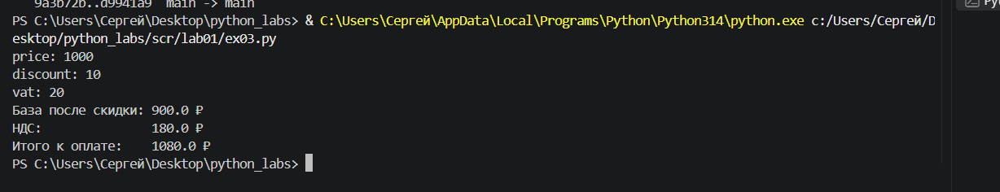
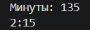
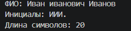

Лабораторная работа №1

Задание 1:
Вводим перемененные отвечающие за имя и года,вводим  переменную с которая плюсует 1 год к нынешнему. Выыодим переменную с именем и с переменную

Задание 2:
Вводим переменные чтобы написать число и replace(, and .) , чтобы могли вводить и точку и запятую. Дальше формула и выводим с round(a,2) чтобы округлить до 2 знаков после запятой. float чтобы сложились числа а не строка

Задание 3: 
Тоже самое вводим переменнаые заменяем replace и пишем формулы. В конце выводим и округляем с помощью round (a,2)

Задание 4:
Вводим переменную , отвечающую за кол-во минут, с помощью целочисл деления определим часы( //), минуты смотрим из остатка от деления, если меньше 10 минут то добавляем 0 ( в минуты, то есть 0:05), если большеш то выводим часы : минуты

Задание 5:
Вводим переменную с фио, юзаем сплит чтобы убрать лишние пробелы, и чтобы срезать по пробелам. Создаем пустую строку, идем циклом for с каждого слова берем 1 букву и делаем ее заглавной(на всякий). Создаем еще 1 пустую строку , идем циклом for (перед 1 словом нет пробелов >= i > 0) Если это не 1 слово добавить пробел в пустую строку, след добавляем слово в строку и считаем через len. Выводим инициалы и кол во симв

