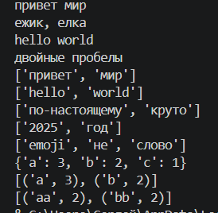

Лабораторная работа №3

Задание А:

```python
import re
def normalize(text, *, casefold=True, yo2e=True):
    result = text
    if casefold == True:
        result = result.casefold()
    if yo2e == True:
        result = result.replace("ё", "е").replace("Ё", "Е")
    result = re.sub(r"\s+", " ", result)
    return result.strip()
print(normalize("ПрИвЕт\nМИр\t"))
print(normalize("ёжик, Ёлка"))
print(normalize("Hello\r\nWorld"))
print(normalize("  двойные   пробелы  "))
```


импортим re, если флаг включен , то превращаем все буквы в нижний регистр (для юникода), если нужно менять е на ё , меняем. регуляркой ищем и заменяем лишние пробелы ((r'\s+') 1 или больше пробелов ) 


```python
def tokenize(text):
    return re.findall(r"\w+(?:-\w+)*", text)
```


регулярка: re.findall - найдет все , \w+ - буквы цифры, (?:) - не запоминать что тут нашлось (дефис, группа слов, * - ноль или больше раз), 2 аргумент где искать


```python
def count_freq(tokens):
    freq = {}
    for word in tokens:
        if word in freq:
            freq[word] = freq[word] + 1
        else:
            freq[word] = 1
    return freq
```


создаем пустой словарь , идем по каждому слову , если оно уже в словаре то увеличиваем счётчик на 1, если нет то создаем запись со знач 1


```python
def top_n(freq, n=5):
    items = []
    for word in freq:
        items.append((word, freq[word]))
    items.sort(key=lambda pair: (-pair[1], pair[0]))
    return items[:n]
```


создаем список для пар, идем по словам, добавляем кортеж из слова и его частоты, далее сортируем по правлиу :
-pair[1] с минус меняем на сорт по убыванию, pair[0] при равных сортируем по алфавиту , return [n:] берет первые n (5) элементов


Задание В:
```python
import sys
import os

sys.path.append(os.path.join(os.path.dirname(__file__), ".."))

from lib.text import normalize, tokenize, count_freq, top_n


def read_input():
    data = sys.stdin.buffer.read()
    for enc in ("utf-8", "cp1251", "cp866"):
        try:
            return data.decode(enc)
        except UnicodeDecodeError:
            continue
    return data.decode("utf-8", errors="replace")


text = normalize(text)
tokens = tokenize(text)
freq = count_freq(tokens)
top = top_n(freq, 5)

print("Всего слов: " + str(len(tokens)))
print("Уникальных слов: " + str(len(freq)))
print("Топ-5:")
for word, count in top:
    print(word + ":" + str(count))
```





импортируем бибилотеки, добавляем пути файло и импортим функции из задания А, функция реад инпут читает ввод как байты , далее пробуем декодировать по очереди если получлось возвращаем если нет с помощ континью продолжаем поиск, если ниче не получлось то декодиурем битые символы на ?  . функуия main - text читаем из ввода, испрользуем все наши функции . Выводи кол во слов, уникальных слов,идем по каждой паре и выводим кол во повторений.


